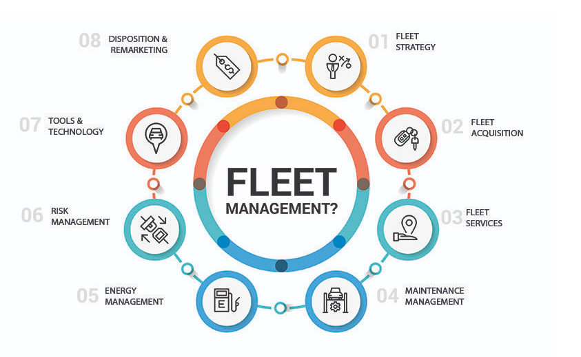
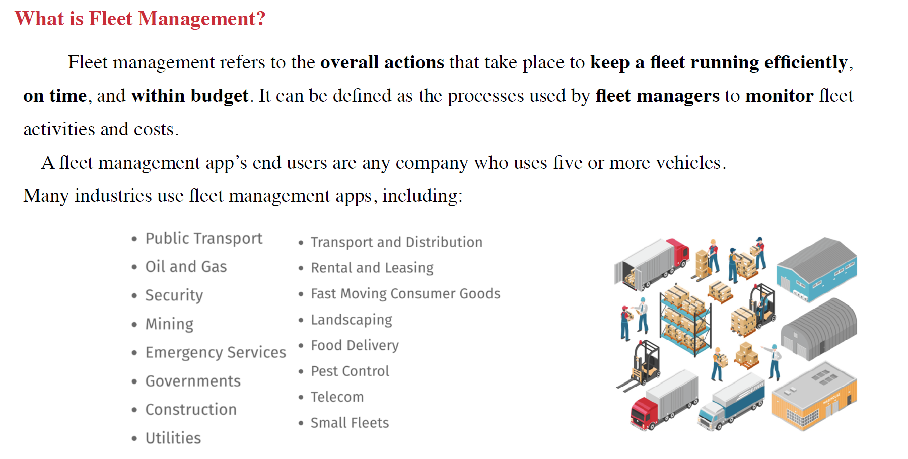
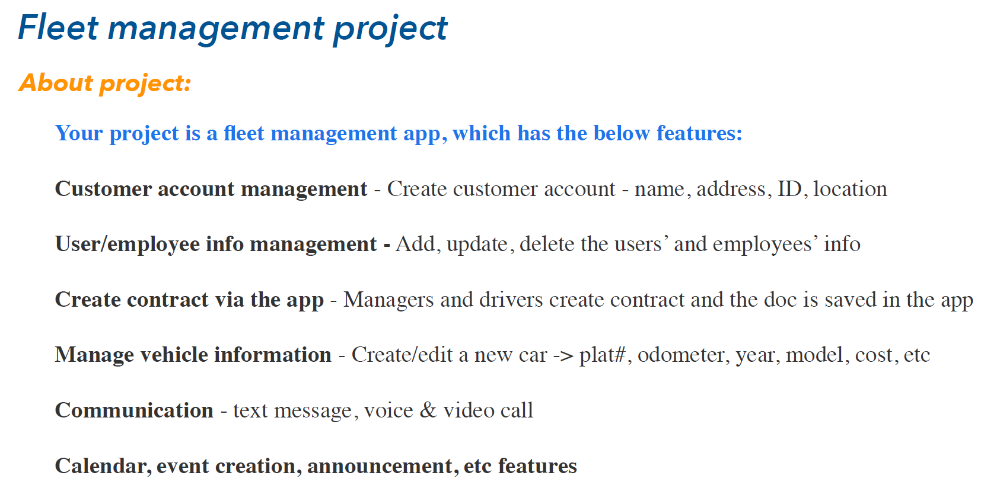
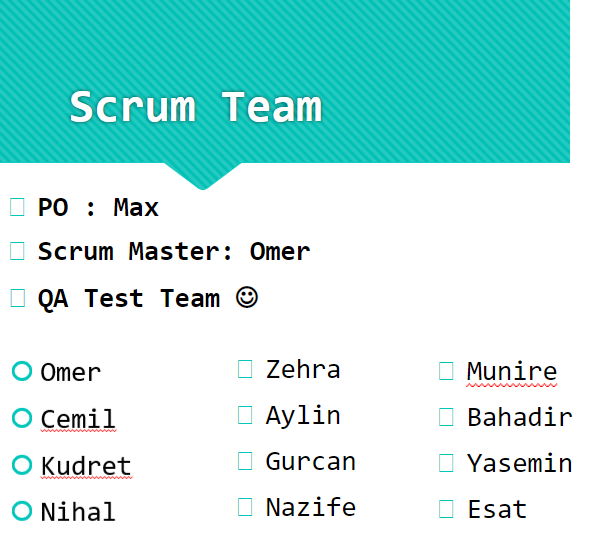

  

  

   *	The domain is the logistics sector. The region covers all of the US states and also includes Canada.

   *	Transmuda online fleet management solution that is highly specialized for companies that handle large vehicle fleets.

   *	It is a web-based application for customers to handle all kinds of management of logistics.

   *	Including, but not limited to, managing and tracking deliveries of the vehicles as well as renting for business use.

   *	It enables the business user to replace the vehicles and track all insurance and registration-related issues. 

   *	There are some other features that make the application unique, like Damage and Vehicle Maintenance

   *	The project users are drivers, managers, and sales managers. 

   *	The Fleet Module is for handling contract management and CRUD operations which means creating, reading, updating, and delete of all kinds of Vehicle information including odometer, fuel cost, and reporting any damage cost

   *	The objective is to verify that the functionality of the application works according to the requirements

